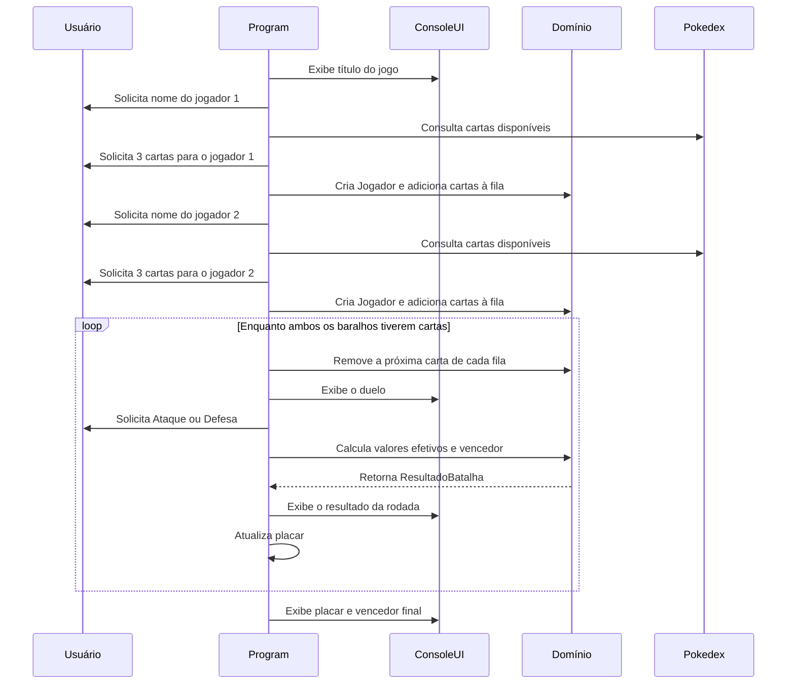
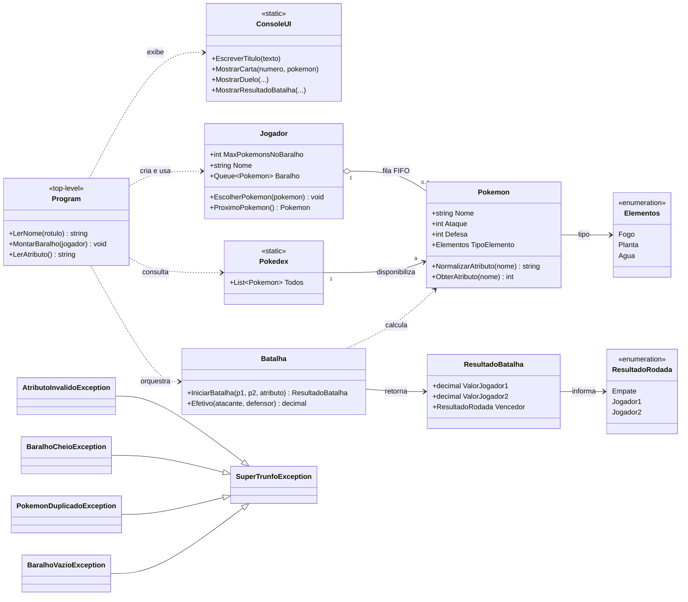

# Documentação Ponta a Ponta: Super Trunfo Pokémon

> Referência técnica do projeto, baseada na implementação atual, no README e na suíte de testes. O documento descreve o comportamento efetivamente existente; não pressupõe banco de dados, APIs ou funcionalidades que não estejam no código.

## Sumário

1. Visão geral
2. Fluxo ponta a ponta
3. Arquitetura e arquivos
4. Dependências e integrações
5. Considerações técnicas
6. Regras de negócio
7. Entidades e métodos
8. Princípios de projeto aplicados
9. Testes de unidade
10. Execução e manutenção
11. Limitações e evoluções
12. Rastreabilidade e referências

---

## 1. Visão Geral

O **Super Trunfo Pokémon** é uma aplicação de console em C# que simula uma partida entre dois jogadores. Cada participante monta um baralho de três cartas Pokémon e disputa rodadas por meio dos atributos **Ataque** ou **Defesa**. O resultado de cada comparação considera tanto o atributo numérico quanto a efetividade entre os tipos Fogo, Planta e Água.

O projeto existe como trabalho acadêmico para exercitar:

- Modelagem com classes, enums e objetos de resultado.
- Uso de uma estrutura de dados FIFO (`Queue<Pokemon>`).
- Validação de regras com exceções específicas do domínio.
- Separação entre cálculo de regras e exibição no console.
- Testes de unidade com xUnit.

### Escopo implementado

| Incluído | Não incluído |
|---|---|
| Dois jogadores humanos no mesmo terminal | Persistência de partidas ou placares |
| Catálogo fixo de nove cartas | Banco de dados, arquivos de save ou API externa |
| Três cartas por jogador | Sorteio de cartas, modo contra computador ou jogo online |
| Ataque, Defesa e efetividade por tipo | Outros atributos, níveis, evolução ou habilidades de Pokémon |
| Validação de entradas principais | Interface gráfica, web ou mobile |
| Testes das regras de domínio | Testes automatizados diretos da interface de console |

### Resultado esperado para o usuário

Ao concluir uma partida, a aplicação mostra o resultado de cada rodada, o placar acumulado e a mensagem de vitória de um dos jogadores ou de empate. Cada execução mantém seus dados apenas em memória e termina após o usuário pressionar Enter.

---

## 2. Fluxo Ponta a Ponta

### Fluxo principal



### Sequência detalhada de execução

1. As instruções top-level em `Program.cs` configuram `Console.OutputEncoding` como UTF-8 para exibir acentos corretamente.
2. `ConsoleUI.EscreverTitulo` mostra o título da aplicação.
3. `LerNome("Jogador 1")` solicita o primeiro nome. Se a entrada for vazia ou composta por espaços, o rótulo `Jogador 1` é usado como nome padrão.
4. Um objeto `Jogador` é criado e passado para `MontarBaralho`.
5. `MontarBaralho` percorre `Pokedex.Todos` e mostra as nove cartas disponíveis.
6. Enquanto o baralho do jogador tiver menos de três cartas, o programa lê o índice de uma carta, busca o Pokémon correspondente na Pokédex e chama `Jogador.EscolherPokemon`.
7. O mesmo processo é repetido para o segundo jogador.
8. O `Program` cria uma instância de `Batalha`, zera os placares e inicia a rodada 1.
9. O laço principal continua enquanto **os dois** baralhos tiverem cartas. No fluxo normal, ambos possuem três cartas e, portanto, ocorrem três rodadas.
10. Em cada rodada, `Jogador.ProximoPokemon` remove a carta no início de cada fila.
11. O programa exibe o duelo e chama `LerAtributo` para obter um atributo válido.
12. `LerAtributo` delega a validação a `Pokemon.NormalizarAtributo`, que só aceita `Ataque` ou `Defesa` e devolve o nome canônico do atributo.
13. `Batalha.IniciarBatalha` busca o valor do atributo de cada Pokémon, aplica a efetividade em cada direção e devolve um `ResultadoBatalha`.
14. `ConsoleUI.MostrarResultadoBatalha` mostra os valores efetivos e o vencedor da rodada.
15. O `Program` incrementa somente o placar do vencedor; empates não alteram pontos.
16. Quando uma fila fica vazia, o programa mostra o placar final e anuncia vitória do jogador 1, do jogador 2 ou empate.
17. O bloco `finally` sempre solicita Enter antes de fechar a aplicação, inclusive quando ocorre uma exceção não tratada internamente.

### Fluxos de entrada inválida

| Entrada | Origem da validação | Comportamento atual |
|---|---|---|
| Nome vazio no fluxo de console | `Program.LerNome` | Substitui pelo rótulo do jogador; a aplicação continua |
| Texto em vez de índice da carta | `int.Parse` em `MontarBaralho` | Captura `FormatException`, mostra erro e pede a carta novamente |
| Número muito grande | `int.Parse` em `MontarBaralho` | Captura `OverflowException`, mostra erro e pede novamente |
| Índice menor que 1 ou maior que 9 | Acesso a `Pokedex.Todos[escolha - 1]` | Captura `ArgumentOutOfRangeException`, mostra erro e pede novamente |
| Carta repetida no mesmo baralho | `Jogador.EscolherPokemon` | Lança e captura `PokemonDuplicadoException`; a escolha é repetida |
| Atributo diferente de Ataque/Defesa | `Pokemon.NormalizarAtributo` | Lança e captura `AtributoInvalidoException`; a pergunta é repetida |
| Regra de domínio que escape dos fluxos internos | Bloco externo de `Program.cs` | Captura `SuperTrunfoException`, mostra a mensagem e encerra normalmente pelo `finally` |
| Erro inesperado | Bloco externo de `Program.cs` | Captura `Exception`, mostra a mensagem e encerra normalmente pelo `finally` |

`BaralhoCheioException` e `BaralhoVazioException` protegem a classe `Jogador` para chamadas diretas. No fluxo padrão da interface, o laço de montagem impede uma quarta carta e a condição do laço de rodadas impede jogar com uma fila vazia.

---

## 3. Arquitetura e Arquivos

### Organização da solução

```text
super-trunfo/
├── SuperTrunfo.slnx
├── README.md
├── SuperTrunfo/
│   ├── SuperTrunfo.csproj
│   ├── Program.cs
│   ├── ConsoleUI.cs
│   ├── Batalha.cs
│   ├── Pokemon.cs
│   ├── Jogador.cs
│   ├── Pokedex.cs
│   ├── Elementos.cs
│   ├── ResultadoBatalha.cs
│   ├── ResultadoRodada.cs
│   └── Excecoes.cs
├── test-super-trunfo/
│   ├── TesteSuperTrunfo.csproj
│   ├── PokemonTeste.cs
│   ├── JogadorTeste.cs
│   ├── IniciarBatalhaTeste.cs
│   └── EfetivoTeste.cs
└── docs/
    ├── apresentacao-super-trunfo.md
    └── documentacao-ponta-a-ponta.md
```

Os diretórios `bin/` e `obj/` são artefatos de compilação e não fazem parte do código-fonte versionado.

### Camadas lógicas

| Camada | Responsabilidade | Elementos |
|---|---|---|
| Ponto de entrada e orquestração | Controla o ciclo da partida, lê entradas e mantém o placar | `Program.cs` |
| Apresentação | Formata e escreve mensagens coloridas no terminal | `ConsoleUI` |
| Domínio do jogo | Modela cartas, jogadores, regras de combate e resultados | `Pokemon`, `Jogador`, `Batalha`, `ResultadoBatalha`, enums |
| Dados em memória | Expõe o catálogo fixo de cartas | `Pokedex` |
| Erros de domínio | Comunica violações das regras | `SuperTrunfoException` e subclasses |
| Verificação | Exercita regras de domínio isoladamente | Projeto `test-super-trunfo` |

### Diagrama de classes

> `Program.cs` usa instruções top-level. O elemento `Program` no diagrama representa o ponto de entrada de forma didática, não uma classe declarada no código.



### Arquivos de produção

| Arquivo | Responsabilidade | Elementos relevantes |
|---|---|---|
| `SuperTrunfo/Program.cs` | Inicializa, conduz a partida, trata entradas e apresenta o resultado final | Instruções top-level, `LerNome`, `MontarBaralho`, `LerAtributo` |
| `SuperTrunfo/ConsoleUI.cs` | Centraliza a saída visual no console | Títulos, cores, cartas, duelos e resultados |
| `SuperTrunfo/Batalha.cs` | Implementa cálculo puro de uma rodada | `IniciarBatalha`, `Efetivo` |
| `SuperTrunfo/Pokemon.cs` | Representa uma carta e valida o atributo solicitado | Propriedades da carta, `NormalizarAtributo`, `ObterAtributo` |
| `SuperTrunfo/Jogador.cs` | Mantém identidade e baralho do jogador | `Queue<Pokemon>`, limite, escolha e retirada de cartas |
| `SuperTrunfo/Pokedex.cs` | Mantém as nove cartas predefinidas em memória | `Todos` |
| `SuperTrunfo/Elementos.cs` | Define tipos possíveis de Pokémon | `Fogo`, `Planta`, `Agua` |
| `SuperTrunfo/ResultadoBatalha.cs` | Transporta valores efetivos e resultado de uma rodada | `ValorJogador1`, `ValorJogador2`, `Vencedor` |
| `SuperTrunfo/ResultadoRodada.cs` | Representa o vencedor sem números mágicos | `Empate`, `Jogador1`, `Jogador2` |
| `SuperTrunfo/Excecoes.cs` | Define a hierarquia de erros do domínio | Exceção base e quatro subclasses |
| `SuperTrunfo/SuperTrunfo.csproj` | Define o executável e o framework alvo | `net10.0`, nullable e implicit usings |

### Arquivos de teste

| Arquivo | Unidade sob teste | Cobertura principal |
|---|---|---|
| `test-super-trunfo/PokemonTeste.cs` | `Pokemon` | Atributos válidos, normalização e exceções |
| `test-super-trunfo/JogadorTeste.cs` | `Jogador` | Nome, tamanho do baralho, duplicidade, FIFO e fila vazia |
| `test-super-trunfo/IniciarBatalhaTeste.cs` | `Batalha.IniciarBatalha` | Vencedores, empate, multiplicadores, Defesa e exceção propagada |
| `test-super-trunfo/EfetivoTeste.cs` | `Batalha.Efetivo` | Todas as combinações de tipos |
| `test-super-trunfo/TesteSuperTrunfo.csproj` | Infraestrutura de testes | xUnit, runner e referência ao projeto principal |

---

## 4. Dependências e Integrações

### Dependências de execução e compilação

| Dependência | Versão/configuração | Uso no projeto |
|---|---|---|
| .NET SDK | `net10.0` | Compila e executa a aplicação e os testes |
| `Microsoft.NET.Sdk` | SDK padrão do projeto | Base dos dois arquivos `.csproj` |
| Biblioteca base do .NET | `System`, `System.Collections.Generic`, `System.Text` | Console, exceções, filas, listas e UTF-8 |
| xUnit | `2.9.3` | Framework dos testes de unidade |
| `xunit.runner.visualstudio` | `2.8.2` | Descoberta e execução dos testes por ferramentas .NET/IDE |
| `Microsoft.NET.Test.Sdk` | `17.12.0` | Host de execução dos testes |
| Referência de projeto | `TesteSuperTrunfo` → `SuperTrunfo` | Permite testar diretamente as classes de produção |

### Integrações inexistentes por projeto

Não há integração com banco de dados, sistema de arquivos, APIs HTTP, autenticação, filas de mensageria, cache, serviços externos ou infraestrutura em nuvem. Todo o estado da partida é mantido em objetos em memória durante a execução atual.

### Interface externa disponível

A única interface do sistema é o terminal:

- **Entrada:** `Console.ReadLine()` para nomes, índices de cartas e atributo.
- **Saída:** `Console.Write` e `Console.WriteLine()`, centralizados majoritariamente em `ConsoleUI`.
- **Feedback visual:** `ConsoleColor` para títulos, tipos, erros, empates e vitórias.

---

## 5. Considerações Técnicas

### Separação entre cálculo e interface

`Batalha` não escreve no console. Ela apenas recebe objetos de domínio e devolve um `ResultadoBatalha`. A exibição é feita depois pelo `ConsoleUI`. Essa separação reduz o acoplamento da lógica de regra com a interface e permite testar o cálculo sem redirecionar a saída padrão.

### Tratamento de erros

As exceções próprias do jogo herdam de `SuperTrunfoException`. Isso permite que o ponto de entrada capture erros de regra com um único `catch`, sem perder a especificidade nos locais que precisam repetir a leitura.

| Exceção | Lançada por | Situação |
|---|---|---|
| `AtributoInvalidoException` | `Pokemon.NormalizarAtributo` | O texto não representa Ataque ou Defesa |
| `BaralhoCheioException` | `Jogador.EscolherPokemon` | Há tentativa de ultrapassar três cartas |
| `PokemonDuplicadoException` | `Jogador.EscolherPokemon` | A mesma instância de carta já está no baralho do jogador |
| `BaralhoVazioException` | `Jogador.ProximoPokemon` | Há tentativa de remover carta de uma fila vazia |
| `ArgumentException` | Construtor de `Jogador` | O nome recebido diretamente é nulo, vazio ou só contém espaços |

### Estruturas de dados e custo

| Estrutura/operação | Uso | Observação |
|---|---|---|
| `Queue<Pokemon>` | Baralho de cada jogador | `Enqueue` e `Dequeue` representam naturalmente a ordem FIFO exigida pela regra |
| `List<Pokemon>` | Catálogo da Pokédex | Acesso por índice é usado na escolha de carta |
| `Queue.Contains` | Verificação de duplicidade | É uma busca linear, mas o limite de três cartas torna o custo irrelevante neste escopo |
| `decimal` | Valores efetivos | Suporta diretamente multiplicadores como `0.5m` |

### Estado, concorrência e persistência

- O estado vive apenas enquanto o processo está aberto.
- A Pokédex é uma lista estática compartilhada, enquanto cada jogador mantém a própria fila de referências para cartas.
- A aplicação é sequencial, usa um único terminal e não implementa concorrência.
- Não há mecanismo de retry automático, transação, persistência ou recuperação de partida.

### Formatação e localização

`ConsoleUI` formata valores com `"0.##"`, removendo casas decimais desnecessárias. O separador decimal mostrado depende da cultura do sistema operacional: em um ambiente pt-BR, por exemplo, `24.5m` é apresentado como `24,5`.

### Segurança

O projeto não trata dados sensíveis, autenticação ou comunicação externa. A proteção de entrada se limita às regras necessárias para manter a partida válida, como parse de número, faixa de índice e atributos permitidos.

---

## 6. Regras de Negócio

| Regra | Implementação | Efeito observável |
|---|---|---|
| A partida possui dois jogadores | `Program.cs` cria `jogador1` e `jogador2` | Os dois montam baralhos e participam de cada rodada |
| Cada jogador possui no máximo três cartas | `Jogador.MaxPokemonsNoBaralho = 3` e `EscolherPokemon` | A quarta carta lança `BaralhoCheioException` |
| A interface normal monta três cartas por jogador | Laço de `MontarBaralho` enquanto `Count < 3` | Uma partida comum inicia com três rodadas possíveis |
| Uma carta não pode ser repetida no mesmo baralho | `Baralho.Contains(pokemon)` | A seleção repetida lança `PokemonDuplicadoException` |
| A mesma carta pode estar nos baralhos de jogadores diferentes | Não há regra global de exclusividade | Cada jogador consulta a mesma Pokédex de forma independente |
| A ordem da escolha define a ordem de jogo | `Queue<Pokemon>` e `ProximoPokemon` | A primeira carta escolhida é jogada primeiro |
| Apenas Ataque ou Defesa são atributos válidos | `Pokemon.NormalizarAtributo` | Outros textos lançam `AtributoInvalidoException` |
| Espaços e caixa do atributo são tolerados | `Trim().ToLower()` em `NormalizarAtributo` | `" ataque "`, `"ATAQUE"` e `"Ataque"` equivalem a `Ataque` |
| Tipos permitidos são Fogo, Planta e Água | Enum `Elementos` | Cada carta possui um único tipo do enum; no código o membro é `Agua` |
| A efetividade é cíclica | `Batalha.Efetivo` | Fogo > Planta > Água > Fogo |
| Tipo em vantagem multiplica por 2 | `Batalha.Efetivo` | Atributo efetivo é dobrado |
| Tipo em desvantagem multiplica por 0,5 | `Batalha.Efetivo` | Atributo efetivo é reduzido à metade |
| Tipos iguais são neutros | Caso padrão de `Batalha.Efetivo` | Multiplicador igual a 1 |
| O vencedor da rodada tem maior valor efetivo | Comparação em `IniciarBatalha` | Resultado é `Jogador1`, `Jogador2` ou `Empate` |
| Empate de valores efetivos não gera ponto | `ResultadoRodada.Empate` não incrementa placar | O placar permanece inalterado na rodada empatada |
| O vencedor final tem mais vitórias | Comparação dos placares após o laço | A aplicação anuncia jogador 1, jogador 2 ou empate final |

### Matriz de efetividade

| Atacante \ Defensor | Fogo | Planta | Água |
|---|---:|---:|---:|
| Fogo | 1x | 2x | 0,5x |
| Planta | 0,5x | 1x | 2x |
| Água | 2x | 0,5x | 1x |

### Fórmula da rodada

```text
valor efetivo = valor do atributo escolhido × multiplicador do tipo
```

Para cada participante, a efetividade é calculada contra o Pokémon adversário. Portanto, uma rodada sempre aplica um multiplicador a cada lado, possivelmente diferente.

```csharp
decimal valor1 = pokemon1.ObterAtributo(atributoEscolhido)
    * Efetivo(pokemon1, pokemon2);
decimal valor2 = pokemon2.ObterAtributo(atributoEscolhido)
    * Efetivo(pokemon2, pokemon1);
```

### Catálogo inicial da Pokédex

| Pokémon | Tipo | Ataque | Defesa |
|---|---|---:|---:|
| Charmander | Fogo | 52 | 43 |
| Magmar | Fogo | 55 | 40 |
| Growlithe | Fogo | 70 | 45 |
| Bulbasaur | Planta | 49 | 49 |
| Ivysaur | Planta | 62 | 63 |
| Oddish | Planta | 50 | 55 |
| Squirtle | Água | 48 | 65 |
| Wartortle | Água | 63 | 80 |
| Psyduck | Água | 52 | 48 |

---

## 7. Entidades e Métodos

### Entidades e objetos de apoio

| Elemento | Tipo | Estado/contrato | Responsabilidade |
|---|---|---|---|
| `Pokemon` | Classe de domínio | `Nome`, `Ataque`, `Defesa` e `TipoElemento` | Representa uma carta jogável e fornece seu atributo solicitado |
| `Jogador` | Classe de domínio | Nome imutável após construção e fila de até três cartas | Mantém o baralho e controla a ordem de saída das cartas |
| `Batalha` | Classe de serviço de domínio | Sem estado persistente | Calcula efetividade, valores e vencedor de uma rodada |
| `Pokedex` | Classe estática | Lista pública de nove instâncias de `Pokemon` | Disponibiliza o catálogo inicial para escolha |
| `ResultadoBatalha` | Objeto de resultado | Dois valores `decimal` e um `ResultadoRodada` | Transporta o resultado do cálculo para o chamador e para a UI |
| `Elementos` | Enum | `Fogo`, `Planta`, `Agua` | Restringe o tipo de cada carta |
| `ResultadoRodada` | Enum | `Empate = 0`, `Jogador1 = 1`, `Jogador2 = 2` | Expressa o resultado sem números mágicos |
| `ConsoleUI` | Classe estática de apresentação | Não guarda estado da partida | Exibe textos, cores, cartas e resultados |
| `SuperTrunfoException` | Exceção base | Herda de `Exception` | Agrupa erros de regra do jogo |

### Métodos de domínio

| Método | Entrada | Saída | Comportamento e erros |
|---|---|---|---|
| `Pokemon.NormalizarAtributo(string)` | Texto informado pelo usuário | `"Ataque"` ou `"Defesa"` | Remove espaços, ignora caixa e lança `AtributoInvalidoException` para qualquer outro valor |
| `Pokemon.ObterAtributo(string)` | Nome do atributo | `int` | Normaliza a entrada e devolve `Ataque` ou `Defesa` |
| `Jogador.Jogador(string)` | Nome | Nova instância | Remove espaços nas extremidades; lança `ArgumentException` se o nome direto for vazio |
| `Jogador.EscolherPokemon(Pokemon)` | Carta | `void` | Adiciona no fim da fila; lança `BaralhoCheioException` ou `PokemonDuplicadoException` quando aplicável |
| `Jogador.ProximoPokemon()` | Nenhuma | Próxima carta | Remove e devolve o início da fila; lança `BaralhoVazioException` se não houver carta |
| `Batalha.IniciarBatalha(Pokemon, Pokemon, string)` | Dois Pokémon e atributo | `ResultadoBatalha` | Calcula valores efetivos, determina o vencedor e propaga atributo inválido |
| `Batalha.Efetivo(Pokemon, Pokemon)` | Atacante e defensor | `decimal` | Devolve `2m`, `0.5m` ou `1m`, conforme a matriz de tipos |

### Métodos de apresentação

| Método | Responsabilidade |
|---|---|
| `ConsoleUI.EscreverTitulo(string)` | Mostra um título em amarelo e restaura a cor padrão |
| `ConsoleUI.EscreverSeparador()` | Mostra uma linha horizontal cinza |
| `ConsoleUI.Escrever(string, ConsoleColor)` | Escreve uma linha na cor recebida |
| `ConsoleUI.EscreverInline(string, ConsoleColor)` | Escreve texto sem quebra de linha na cor recebida |
| `ConsoleUI.CorDoTipo(Elementos)` | Mapeia Fogo para vermelho, Planta para verde e Água para ciano |
| `ConsoleUI.NomeDoTipo(Elementos)` | Converte o valor técnico `Agua` no texto exibido `Água` |
| `ConsoleUI.MostrarCarta(int, Pokemon)` | Mostra índice, nome, atributos e tipo de uma carta |
| `ConsoleUI.MostrarDuelo(Jogador, Pokemon, Jogador, Pokemon)` | Mostra os dois Pokémon da rodada |
| `ConsoleUI.MostrarResultadoBatalha(...)` | Mostra valores efetivos e mensagem específica de vitória ou empate |

### Métodos locais do ponto de entrada

| Método | Responsabilidade |
|---|---|
| `LerNome(string rotulo)` | Lê o nome e devolve o rótulo padrão caso a entrada esteja vazia |
| `MontarBaralho(Jogador jogador)` | Lista cartas, lê índices, recupera erros de escolha e monta três cartas para o jogador |
| `LerAtributo()` | Lê e valida Ataque/Defesa até receber um valor aceito |

### Hierarquia de exceções

```text
Exception
└── SuperTrunfoException
    ├── AtributoInvalidoException
    ├── BaralhoCheioException
    ├── PokemonDuplicadoException
    └── BaralhoVazioException
```

---

## 8. Princípios de Projeto Aplicados

| Princípio | Evidência no código | Benefício prático |
|---|---|---|
| Separação de responsabilidades | `ConsoleUI` apresenta; `Batalha` calcula; `Jogador` administra a fila | Mudanças visuais não precisam alterar a regra de combate |
| Responsabilidade única em nível de classe | Cada classe de domínio possui uma função principal bem delimitada | Facilita leitura e testes unitários focalizados |
| Encapsulamento de regras | `Jogador` protege limite, ordem e fila; `Pokemon` centraliza atributo válido | O chamador não precisa repetir validações de negócio |
| Exceções de domínio | Erros próprios herdam de `SuperTrunfoException` | Os fluxos de erro são explícitos e podem ser tratados de forma centralizada |
| Tipos expressivos | `Elementos` e `ResultadoRodada` são enums | Evita strings ou números mágicos para estados conhecidos |
| Estrutura de dados aderente ao domínio | `Queue<Pokemon>` representa a ordem obrigatória de jogo | O comportamento FIFO vem da própria estrutura escolhida |
| Constantes nomeadas | `Jogador.MaxPokemonsNoBaralho` | O limite de três não fica disperso como literal no fluxo principal |
| Testabilidade | `Batalha` não depende de `Console` | A regra é determinística e pode ser exercitada diretamente pelo xUnit |
| Testes legíveis | Arrange/Act/Assert, helpers e testes parametrizados | Cenários e expectativas são fáceis de identificar |

O projeto aplica esses princípios em um escopo simples. Ele não implementa uma arquitetura completa baseada em interfaces, injeção de dependência ou persistência, pois essas necessidades não existem na funcionalidade atual.

---

## 9. Testes de Unidade

### Configuração

O projeto `test-super-trunfo` referencia diretamente `SuperTrunfo/SuperTrunfo.csproj` e é marcado com `<IsTestProject>true</IsTestProject>`. A suíte utiliza xUnit, atributos `[Fact]` para cenários únicos e `[Theory]` com `[InlineData]` para variações do mesmo comportamento.

Todos os testes seguem, total ou parcialmente, o padrão **Arrange / Act / Assert (AAA)**:

```csharp
// Arrange
var pokemon = CriarCharmander();

// Act
var resultado = pokemon.ObterAtributo("Ataque");

// Assert
Assert.Equal(52, resultado);
```

### Cobertura por classe

| Classe de teste | Casos executados | Cenários cobertos |
|---|---:|---|
| `PokemonTests` | 13 | Retorno de Ataque/Defesa, normalização de espaços e caixa, atributo inválido, atributo vazio e herança da exceção |
| `JogadorTests` | 8 | Nome vazio, inclusão de carta, limite de três, duplicidade, ordem FIFO, remoção e fila vazia |
| `IniciarBatalhaTests` | 7 | Vitória de cada lado, empate, vantagem, desvantagem, uso de Defesa e propagação de atributo inválido |
| `EfetivoTests` | 9 | Seis relações de vantagem/desvantagem e três confrontos de tipos iguais |
| **Total** | **37** | **Regras centrais do domínio** |

### Evidência dos principais comportamentos

| Regra | Teste correspondente |
|---|---|
| Fogo contra Planta aplica 2x | `IniciarBatalha_WhenAttackerHasTypeAdvantage_DoublesTheEffectiveValue` |
| Planta contra Fogo aplica 0,5x | `IniciarBatalha_WhenAttackerHasTypeDisadvantage_HalvesTheEffectiveValue` |
| Defesa é usada quando selecionada | `IniciarBatalha_WhenAttributeIsDefesa_UsesDefesaAndNotAtaque` |
| Atributo inválido é propagado pela batalha | `IniciarBatalha_WhenAttributeIsInvalid_ThrowsAtributoInvalidoException` |
| A fila preserva a ordem de escolha | `ProximoPokemon_ReturnsPokemonsInTheOrderTheyWereChosen` |
| Não há quarta carta | `EscolherPokemon_WhenDeckIsFull_ThrowsBaralhoCheioException` |
| Tabela de tipos está completa | `Efetivo_WhenGivenAttackerAndDefenderTypes_ReturnsExpectedMultiplier` |

### Execução

Na raiz do repositório:

```powershell
dotnet test "SuperTrunfo.slnx"
```

Verificação executada durante a elaboração desta documentação:

```text
Aprovado!  - Com falha: 0, Aprovado: 37, Ignorado: 0, Total: 37
```

### Escopo que ainda não possui cobertura automatizada direta

- Leitura e escrita reais do `Console` em `Program.cs`.
- Formatação, cores e textos de `ConsoleUI`.
- Conteúdo estático da `Pokedex` como contrato de dados.
- Fluxo ponta a ponta completo com duas escolhas de baralho e três rodadas.
- Comportamento com objetos `Pokemon` nulos ou mutados externamente.

Essas ausências não invalidam a cobertura atual das regras de domínio, mas delimitam a confiança fornecida pela suíte: ela comprova a lógica testada, e não toda a experiência de terminal.

---

## 10. Execução e Manutenção

### Pré-requisito

Instale o SDK do .NET compatível com `net10.0`.

### Executar a aplicação

Na raiz do repositório:

```powershell
dotnet run --project SuperTrunfo
```

O terminal solicitará os nomes, três cartas para cada jogador e um atributo por rodada. Ao final, pressione Enter para sair.

### Executar os testes

```powershell
dotnet test "SuperTrunfo.slnx"
```

Execute jogo e testes em sequência, e não em paralelo, pois ambos podem tentar compilar e gravar os mesmos artefatos de saída.

### Adicionar uma carta

1. Inclua uma instância de `Pokemon` em `Pokedex.Todos` com nome, ataque, defesa e tipo existentes.
2. Avalie se a interface deve continuar exibindo todas as cartas; ela já percorre a lista dinamicamente.
3. Atualize ou crie testes se a nova carta participar de um cenário específico.
4. Não altere a regra de três cartas sem também revisar os testes e a experiência de montagem do baralho.

### Adicionar um novo tipo

1. Inclua o tipo em `Elementos`.
2. Atualize `ConsoleUI.CorDoTipo` e `ConsoleUI.NomeDoTipo` para a apresentação correta.
3. Defina todas as relações do novo tipo em `Batalha.Efetivo`.
4. Amplie `EfetivoTests` para cobrir vantagens, desvantagens e neutralidade do novo tipo.
5. Atualize a tabela de regras e a Pokédex, se houver novas cartas.

### Adicionar um novo atributo

1. Adicione a propriedade ao modelo `Pokemon`.
2. Atualize `Pokemon.NormalizarAtributo` para aceitar o novo nome.
3. Atualize `Pokemon.ObterAtributo` para devolvê-lo.
4. Atualize as mensagens e a UI para permitir a escolha.
5. Adicione cenários válidos e inválidos em `PokemonTests` e `IniciarBatalhaTests`.

---

## 11. Limitações e Evoluções Possíveis

| Limitação atual | Consequência | Evolução recomendada |
|---|---|---|
| `Pokedex.Todos` é uma `List<Pokemon>` pública e mutável | Qualquer código pode alterar o catálogo ou atributos durante a execução | Expor uma coleção somente leitura e usar objetos imutáveis ou cópias defensivas |
| Propriedades de `Pokemon` possuem `set` público | Cartas podem ser modificadas depois de entrar no baralho | Usar construtor e propriedades somente leitura quando o catálogo se tornar estável |
| Duplicidade depende da identidade da instância | Dois objetos diferentes com o mesmo nome não são considerados duplicados | Criar ID único ou implementar igualdade por identificador |
| Interface depende diretamente de `Console` | Testes de fluxo completo e diferentes interfaces exigem adaptação | Abstrair entrada/saída por interface ou serviço de UI |
| Não há persistência | Placar e configuração são perdidos ao encerrar | Adicionar armazenamento local ou banco de dados quando houver necessidade real |
| Não há aleatoriedade ou IA | Toda partida requer dois participantes no mesmo terminal | Implementar sorteio, bot ou modo solo |
| Não há testes de integração/fim a fim | A experiência completa do usuário depende de verificação manual | Criar testes de fluxo após desacoplar `Console` |

---

## 12. Rastreabilidade e Referências

### Mapa de código para comportamento

| Assunto | Arquivo | Pontos relevantes |
|---|---|---|
| Ciclo da partida, entrada e placar | `SuperTrunfo/Program.cs` | Linhas 7 a 165 |
| Saída no terminal | `SuperTrunfo/ConsoleUI.cs` | Linhas 6 a 115 |
| Cálculo de valores e efetividade | `SuperTrunfo/Batalha.cs` | Linhas 7 a 45 |
| Validação de atributo | `SuperTrunfo/Pokemon.cs` | Linhas 15 a 45 |
| Baralho e regras do jogador | `SuperTrunfo/Jogador.cs` | Linhas 8 a 52 |
| Catálogo de cartas | `SuperTrunfo/Pokedex.cs` | Linhas 6 a 20 |
| Tipos e resultado de rodada | `SuperTrunfo/Elementos.cs`, `SuperTrunfo/ResultadoRodada.cs` | Enums do domínio |
| Resultado calculado | `SuperTrunfo/ResultadoBatalha.cs` | Linhas 5 a 10 |
| Hierarquia de erros | `SuperTrunfo/Excecoes.cs` | Linhas 5 a 49 |
| Testes de atributos | `test-super-trunfo/PokemonTeste.cs` | Linhas 8 a 116 |
| Testes do jogador | `test-super-trunfo/JogadorTeste.cs` | Linhas 9 a 117 |
| Testes da batalha | `test-super-trunfo/IniciarBatalhaTeste.cs` | Linhas 8 a 112 |
| Testes de efetividade | `test-super-trunfo/EfetivoTeste.cs` | Linhas 7 a 35 |

### Fontes

1. SUPER TRUNFO POKÉMON. *Código-fonte e README do repositório analisado*. Disponível em: <https://github.com/jonasPereira533/super-trunfo>.
2. ÇAKIROĞLU, Kaan Furkan. *Unit Testing Best Practices*. Medium, 2023. Disponível em: <https://medium.com/@kaanfurkanc/unit-testing-best-practices-3a8b0ddd88b5>.
3. IAMPROVIDENCE. *Unit Tests*. Medium, 2025. Disponível em: <https://medium.com/@iamprovidence/unit-tests-018611590eac>.
